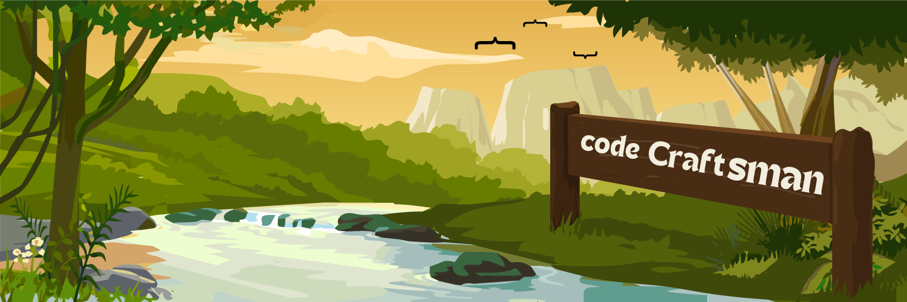

# 🏄‍♂️ Basil Pulikuth

**`Code Craftsman (Developer/Reader/Creator)`**

I'm an independent full-stack web developer specializing in the MERN stack. I thrive on solving complex problems in innovative ways and building robust, real-world solutions. My approach combines attention to detail with a knack for thinking outside the box, always aiming to uncover and address the root causes of issues. I am dedicated to applying my skills to make a meaningful impact in the digital landscape.

    
    
   

---

### 🧰 Languages and Tools

#### Frontend

   
   
   
   
   
   
   
   
   
   
   

#### Backend

   
   
   

#### Tools

   
   
   
   
   
   
   
   

---

For more information about me and my projects, visit my [personal website](https://personal-portfolio-nextjs-kappa.vercel.app) or connect with me on [LinkedIn](https://www.linkedin.com/in/iambasilp).
